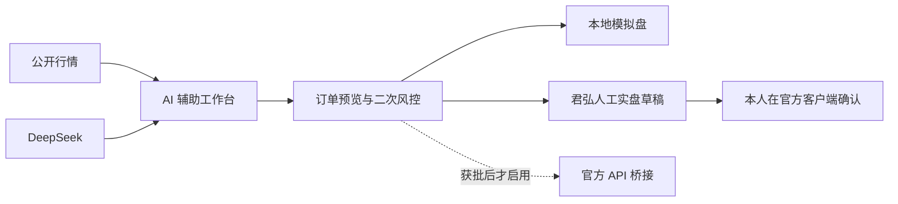

# A 股 AI 辅助交易工作台

基于 [tonghuashun-webui](https://github.com/renat3u/tonghuashun-webui) 改造的本地工作台，当前 fork 为 [Kairos2425/tonghuashun-webui](https://github.com/Kairos2425/tonghuashun-webui)。项目面向股票新手，把行情、DeepSeek 研究、模拟交易、风险校验和国泰海通君弘实盘确认放在同一个界面中。

这不是无人值守交易程序，也不构成投资建议。当前最稳妥的实盘路径是：

```text
AI 研究 -> 风控预览 -> 锁定君弘订单草稿 -> 本人在君弘官方客户端核对并确认 -> 成交回填
```

工作台不模拟点击君弘、不逆向登录、不读取或保存交易密码。普通君弘账户不能因为填写了资金账号就变成 API 账户；未获得券商正式接口权限前，自动下单始终锁定。

## 当前能力

| 能力 | 状态 | 说明 |
| --- | --- | --- |
| 沪深北行情与日 K | 可用 | 腾讯公开行情，仅作参考，委托前以券商报价为准 |
| 自定义证券 | 可用 | 输入任意沪深北 6 位代码，可选 `.SH`、`.SZ`、`.BJ` |
| 本地模拟盘 | 可用 | 初始资金 1 万元，含持仓、T+1、费用估算和订单记录 |
| 君弘账户镜像 | 可用 | 手工抄录可用资金与持仓，Windows DPAPI 加密，不保存账号密码 |
| DeepSeek 分析 | 待用户配置 Key | Key 由 Windows DPAPI 加密，不写入源码或浏览器存储 |
| DeepSeek Harness | 已集成 | 独立工作区默认运行在 `127.0.0.1:3080` |
| 机器学习量化研究 | 可用 | 9 个量价特征、走步样本外回测、成本/滑点和相对价值监控 |
| 横截面 ETF 组合 | 可用 | 6 只宽基/风格 ETF 相对选优、逆波动权重和现金缓冲 |
| 影子组合 | 可用 | 收盘后记录目标权重，不调用任何模拟或实盘下单接口 |
| 模型治理 | 可用 | 固定压力场景、时间分段、试验次数、数据指纹和影子后验结算 |
| 策略自动执行 | 模拟盘可用 | 默认关闭，仅限 ETF 模拟账户；真实资金自动执行保持硬锁定 |
| 国泰海通君弘人工实盘 | 可用 | 生成草稿后，由本人在君弘 APP 或富易桌面端确认 |
| 国泰海通 STS / 官方 API | 默认锁定 | 需先完成程序化交易报告、券商授权和官方桥接 |
| 同花顺 SuperMind | 连接器已预留 | 需购买实盘能力、确认券商支持并取得官方权限 |

## 安全边界

- 服务默认只监听 `127.0.0.1`，拒绝外部主机和不可信网页发起写操作。
- 默认单笔上限 `1000` 元、单日累计上限 `3000` 元。
- 限价偏离公开参考价超过 `5%` 时阻断，超过 `3%` 时警告。
- 股票按 `0.01` 元价格档位、ETF/基金按 `0.001` 元档位校验。
- 沪深主板与场内基金、科创板、北交所分别采用对应的最低申报量和递增规则；零股卖出校验全部零股余量。
- 君弘账户镜像只在抄录当日参与保守风控：不足时阻断，充足时仍显示警告并要求在君弘复核。
- 订单预览 5 分钟失效；提交时重新拉取行情并再次执行风控。
- 人工实盘无法读取真实余额、持仓和佣金时只显示“需在君弘复核”，不会伪造通过结果。
- 演示行情不会用于实盘价格偏离校验；接口实盘在没有真实参考价时直接阻断。
- 指数、可转债和无法可靠识别的代码只允许观察，订单入口仅面向已识别的 A 股与场内基金。
- 接口实盘同时受 `LIVE_TRADING_ENABLED` 和官方桥接凭据控制，缺一不可。

## Windows 部署

要求 Node.js `>= 20.19`。在 PowerShell 中执行：

```powershell
Set-Location E:\stokc
Copy-Item .env.example .env.local
npm ci
npm run verify
npm start
```

生产工作台地址：

```text
http://127.0.0.1:4174
```

另开一个 PowerShell 窗口启动 DeepSeek Harness：

```powershell
Set-Location E:\stokc
npm run harness
```

Harness 地址：

```text
http://127.0.0.1:3080
```

`npm start` 和 `npm run harness` 都会读取仓库根目录的 `.env.local`。操作系统中已经存在的环境变量优先，不会被文件覆盖。

## DeepSeek 配置

1. 打开工作台右上角“设置”。
2. 输入本人从 DeepSeek 官方平台取得的 API Key。
3. 保存后，Key 只写入 `.data/deepseek-key.dpapi`，并由当前 Windows 用户的 DPAPI 保护。若 Key 来自环境变量，设置页会保持只读。
4. 重启 Harness 后，启动脚本会把 Key 注入 Harness 子进程。

不要把 Key 写入 README、截图、Git 提交或聊天内容。复制 DPAPI 文件到另一台电脑或另一个 Windows 用户下通常无法解密，这是预期行为。

## 君弘实盘流程

建议先在模拟盘完整走通一笔，再进行首笔小额实盘：

1. 在“交易”或“账户”页，从君弘“资金股份”页面手工抄录可用资金、总资产、持仓和当日可卖数量。不要录入资金账号或交易密码。
2. 在自选列表输入证券代码，确认名称、交易所、价格档位和数量规则。
3. 查看 K 线和风险标签；需要时用 DeepSeek 生成“支持理由、反对理由、失效条件和待核实事项”。
4. 在“模拟账户”完成至少一笔同方向、同数量级的订单。
5. 将交易通道切换到“国泰海通君弘”。
6. 输入限价和数量，生成订单预览，逐条查看通过、警告和阻断项。
7. 按界面要求输入一次性确认文本并锁定草稿。此时订单尚未发送给券商。
8. 点击“打开君弘”。已安装富易时工作台会启动客户端；未安装时会打开官方下载页。也可以直接使用手机君弘 APP。
9. 在君弘内重新核对证券代码、买卖方向、限价、数量、可用资金或可卖数量，再由本人点击最终确认。
10. 全部成交、部分成交、余量撤单或被拒后，在“实盘订单审计”中持续回填状态、累计成交价/数量、合同号和复盘备注。

A 股买入通常以 100 股为一手。默认单笔 1000 元保护线意味着高于 10 元的股票可能连一手都无法提交，这是有意的保护；不要为了绕过限制随意调高额度。实际佣金、最低佣金和规费以本人账户交割单为准。

数量规则并非所有市场都相同。工作台按 2026 年现行规则处理：沪深主板股票和普通场内基金买入为 100 股（份）或其整数倍；科创板限价申报最低 200 股，之后可按 1 股递增；北交所竞价交易最低 100 股，之后可按 1 股递增。规则依据见[上交所 2026 年交易规则](https://www.sse.com.cn/lawandrules/sselawsrules2025/stocks/exchange/c/c_20260424_10816482.shtml)、[深交所 2026 年交易规则](https://www.szse.cn/lawrules/rule/trade/current/t20260424_620190.html)和[北交所交易规则](https://www.bse.cn/jygl_list/200028217.html)。券商前端可能有更严格的权限或品种控制，最终以君弘提示为准。

## AI 量化研究实验室

“量化”页面借鉴的是幻方量化公开披露的方法论，而不是其未公开的策略。幻方官网公开提到：从 2008 年开始探索机器学习全自动量化交易，使用神经网络处理海量数据，并建设“萤火”训练平台快速验证研究想法。其具体数据、因子、标签、模型参数、组合优化和执行算法并未公开，因此本项目不会声称复制“梁文峰策略”。参考：[幻方量化基金](https://www.high-flyer.cn/fund/)、[幻方 AI 平台](https://www.high-flyer.cn/index.html)。

当前实验室实现一套可解释基线：

1. 从前复权日 K 构造 1/5/20 日收益、均线偏离、波动率、日内强弱、量能 Z 分数和 RSI 等 9 个特征。
2. 使用带 L2 正则的逻辑回归预测下一交易日收益是否超过最低目标阈值。
3. 严格按时间向前走步：每个测试点只用此前已经完成的样本训练，信号在当日收盘后形成，回测在下一交易日开盘价加滑点执行。
4. 只报告样本外收益、买入持有基准、最大回撤、夏普、方向准确率、胜率和估算交易成本。
5. 同指数 ETF 使用 60 日对数价差 Z 分数观察相对偏离。普通现金账户不能对称做空，因此只称“相对价值/换仓观察”，不称无风险套利。
6. 横截面模型比较 6 只宽基/风格 ETF 的下一日相对收益；概率低于固定 55% 门槛时保留现金，避免弱信号制造高换手和最低佣金损耗。

默认横截面研究池为：`510300` 沪深300ETF、`510500` 中证500ETF、`512100` 中证1000ETF、`588000` 科创50ETF、`159915` 创业板ETF和 `510880` 红利ETF。代码与基金身份已通过交易所公开资料核对，例如[上交所 ETF 列表与公告](https://etf.sse.com.cn/disclosure/ssenotice/c/c_20260128_10807224.shtml)、[南方基金 ETF 简称公告](https://www.sse.com.cn/disclosure/fund/announcement/c/new/2026-03-20/512400_20260320_AS8X.pdf)、[深交所创业板 ETF 通知](https://www.szse.cn/disclosure/notice/general/t20220916_595887.html)。研究池不包含跨境、商品、债券、杠杆或行业主题 ETF，以减少不可比性。

影子组合默认关闭。启用后，服务会在交易日收盘后 `15:10` 自动记录一次模型排名、目标权重、现金权重和当时的样本外指标；“立即记录”也只写本地研究快照，不生成订单。建议至少积累 30–60 个不同市场状态下的交易日，再决定是否值得继续开发模拟组合执行。

“模型治理”区域固定运行 7 个预先声明的场景：52/55/58% 置信门槛、5/10 日换仓、15 基点滑点、费用翻倍和单笔 500 元。系统保存全部场景，不会只展示最优结果；同时把样本外曲线分成三个连续时间段，检查超额收益是否集中在单一阶段。每次审计都会登记实验 ID、已知试验次数和历史数据 SHA-256 指纹。此设计参考了 Bailey、Borwein、López de Prado、Zhu 关于回测过拟合的研究：尝试的配置越多，挑中虚假优秀结果的概率越高，必须披露试验与选择过程。[原始论文](https://papers.ssrn.com/sol3/papers.cfm?abstract_id=2308659)。

每次产生新的影子快照时，系统会用后续完整收盘行情结算上一快照的目标权重收益、研究池等权收益和超额收益。少于 20 个已结算快照时状态始终为“证据不足”；达到 20 个后，如果累计落后基准或超额命中率低于 50%，标记为漂移警告。它仍只是低样本监控，不是统计显著性证明。

模拟盘策略机器人默认关闭。启用后只允许场内 ETF，只使用已经收盘的日 K 生成信号，并仅在下一交易日 `09:35–09:50`（北京时间）处理一次。它继续受单笔 1000 元、单日 3000 元、现金、持仓、整手和 T+1 风控约束；窗口外的“立即评估”只返回预览，不成交。服务端拒绝任何将机器人模式改为 `live` 的请求。

真实资金自动生成或下达交易指令属于程序化交易。根据[证监会《证券市场程序化交易管理规定（试行）》](https://www.csrc.gov.cn/csrc/c100028/c7480577/content.shtml)和[上交所实施细则](https://www.sse.com.cn/lawandrules/sselawsrules2025/trade/universal/c/c_20250612_10781696.shtml)，应完成报告并符合券商、交易所的系统与风控要求。因此，研究结果可以生成模拟单或君弘人工草稿，但在获得正式权限前不会自动发送真实委托。

## 富易官方客户端

只从[国泰海通富易官方下载页](https://fy.gtht.com/fuyi-download/)获取客户端。本次部署于 2026-08-18 从官网接口核验到：

| 项目 | 官网值 |
| --- | --- |
| Windows 版本 | `V4.29.6.0804` |
| 文件名 | `setup_fy_super_20260805.exe` |
| 文件大小 | `348,994,056` 字节 |
| 官网 MD5 | `d9f81b52ced2038cb045577331deb56f` |
| CDN 最后修改时间 | `2026-08-05 11:19:18 GMT` |

官网版本会更新，安装时应以下载页当日公布的版本和 MD5 为准，并在 Windows 文件属性中确认数字签名有效。工作台会从环境变量、常见安装目录和 Windows 卸载注册表中查找富易；若自动检测失败，在 `.env.local` 中填写：

```dotenv
GTJA_CLIENT_PATH=C:\Path\To\OfficialClient.exe
```

富易桌面端不是生成草稿的前置条件：只安装了手机君弘 APP 时，仍可在工作台锁定草稿，再到手机端手工录入和确认。

## STS / 官方 API 边界

国泰海通[开放金融云](https://open.gtja.com/)公开介绍了智能交易服务，但没有把普通君弘账号登录信息当作通用交易 API 凭据。需要通过客户经理或客服 `95521` 确认以下事项：

1. 本人账户是否允许程序化交易，以及适用的投资者条件。
2. 是否需要先在专业化交易服务平台完成程序化交易报告。
3. 可用产品究竟是 STS、算法交易终端还是正式 API/SDK。
4. 券商提供的测试环境、接口文档、证书、IP 白名单和风控要求。
5. 软件名称、版本、最高申报速率和单日最高申报笔数应如何报告。

官方程序化交易咨询入口还包括[国泰海通程序化交易报告白皮书](https://vintex.gtja.com/guidebook/)；开放金融云公开的智能交易咨询邮箱为 `fuyitest@gtht.com`。

监管层面，[证监会《证券市场程序化交易管理规定（试行）》](https://www.csrc.gov.cn/csrc/c100028/c7480577/content.shtml)要求程序化交易“先报告、后交易”；[上交所实施细则](https://www.sse.com.cn/lawandrules/sselawsrules2025/trade/universal/c/c_20250612_10781696.shtml)自 2025-07-07 起施行，并把个人投资者纳入程序化交易投资者范围。因此，取得接口技术资料不等于已经可以直接实盘。

券商正式批准并提供本地桥接服务后，才配置：

```dotenv
GTJA_API_BRIDGE_URL=http://127.0.0.1:9001
GTJA_API_BRIDGE_TOKEN=replace-with-local-bridge-token
LIVE_TRADING_ENABLED=true
```

桥接必须是依据券商正式文档实现的本地服务。不要把网页接口、客户端私有协议、自动点击或交易密码包装成“API”。

## 同花顺 SuperMind

工作台保留了 SuperMind 连接器合同，但当前不会假装已经连通。同花顺[官方研究环境/实盘文档](https://quant.10jqka.com.cn/view/help/14)明确说明实盘依赖客户端、已登录资金账号和 `TradeAPI`；真实资金能力、支持券商和费用需要向 SuperMind 官方确认。

获批并完成官方桥接后使用：

```dotenv
SUPERMIND_BRIDGE_URL=http://127.0.0.1:9002
SUPERMIND_BRIDGE_TOKEN=replace-with-local-bridge-token
LIVE_TRADING_ENABLED=true
```

每个券商适配器都必须独立处理认证、查询、下单、撤单、成交回报、幂等和审计，不能把某个平台的私有接口假定为通用协议。

## 配置项

| 变量 | 默认值 | 用途 |
| --- | --- | --- |
| `WORKBENCH_HOST` | `127.0.0.1` | 工作台监听地址，建议不要改成公网地址 |
| `WORKBENCH_PORT` | `4174` | 生产工作台端口 |
| `WORKBENCH_DATA_DIR` | `.data` | 本地账户、审计和 DPAPI 文件目录 |
| `MAX_ORDER_VALUE` | `1000` | 单笔委托金额上限，人民币元 |
| `MAX_DAILY_VALUE` | `3000` | 当日累计委托金额上限，人民币元 |
| `MARKET_DATA_PROVIDER` | `tencent` | 设为 `demo` 时只使用演示行情 |
| `DEEPSEEK_MODEL` | `deepseek-chat` | DeepSeek 分析模型 |
| `GTJA_CLIENT_PATH` | 自动检测 | 富易主程序路径 |
| `LIVE_TRADING_ENABLED` | `false` | 官方接口实盘总开关 |

## 数据与审计

```text
.data/paper-account.json     模拟账户、持仓和订单
.data/live-account.dpapi     DPAPI 加密的君弘资金与持仓手工镜像
.data/manual-orders.json    君弘人工实盘草稿及回填状态
.data/audit.jsonl           预览、AI 分析和实盘动作审计
.data/deepseek-key.dpapi    Windows DPAPI 加密后的 DeepSeek Key
.data/strategy-automation.json 模拟盘策略机器人配置与最近 50 次评估
.data/quant-shadow.json        横截面影子组合配置与最近 120 个信号日快照
.data/quant-experiments.json   最近 50 次固定场景模型审计和数据指纹
.dsh/                       DeepSeek Harness 本地工作区数据
```

这些目录已被 Git 忽略。备份前应确认文件中是否含账户相关数据；不要把它们推送到远程仓库。

## 开发与验证

```powershell
npm run dev        # 前端 4173 + API 4174
npm run typecheck  # TypeScript 检查
npm test           # 风控、行情、模拟盘、人工订单、连接器和 API 测试
npm run build      # 生成 dist
npm run verify     # typecheck + test + build
```

生产模式由 `server/index.mjs` 同时提供静态前端和本地 API。主要模块：

```text
src/                              React 工作台
server/core/market.mjs            行情与证券代码归一化
server/core/risk.mjs              订单风控、费用估算和预览
server/core/paper-broker.mjs      本地模拟券商
server/core/manual-orders.mjs     君弘草稿、回填和审计
server/core/live-account.mjs      君弘账户镜像校验与 DPAPI 加密存储
server/core/quant-research.mjs    机器学习走步回测与 ETF 相对价值模型
server/core/strategy-automation.mjs 模拟盘自动执行配置和审计状态
server/core/shadow-portfolio.mjs 横截面研究池和无交易影子快照
server/core/experiment-registry.mjs 模型卡、试验次数和数据版本登记
server/core/connectors.mjs        君弘、STS 与 SuperMind 连接器
server/core/secrets.mjs           Windows DPAPI 密钥存储
scripts/harness.mjs               DeepSeek Harness 启动与 Key 注入
```



## 已知限制

- 公开行情可能延迟、缺失或与券商盘口不同，不能用于无人值守下单。
- AI 默认没有实时公告和新闻全文，分析结果必须回到交易所公告和券商页面核实。
- 当前机器学习基线只使用最多约 500 条公开日 K，不能与专业机构的多源高频数据、算力和交易基础设施等同。
- 相对价值信号可能长期不回归；交易费用、跟踪误差和无法做空会使表面价差不可交易。
- 模拟盘自动执行不代表策略已经适合实盘；至少需要跨市场状态、滚动样本外和足够长时间的模拟观察。
- 横截面研究池只有 6 只 ETF，样本规模和数据维度仍不足以证明稳定的相对收益能力。
- 固定场景审计只能暴露一部分脆弱性，不能消除多重检验、幸存者偏差或研究人员自由度。
- 人工实盘模式不会自动登录或读取君弘。账户镜像来自手工抄录，只在当日用于保守阻断，买入余额、卖出可用数量、T+1 和真实佣金仍必须在君弘再次检查。
- 当前没有国泰海通正式 API 权限和桥接凭据，因此接口实盘保持锁定。
- 当前没有 SuperMind 实盘许可和受支持资金账号，因此只保留扩展接口，不提供虚假“已连接”状态。
